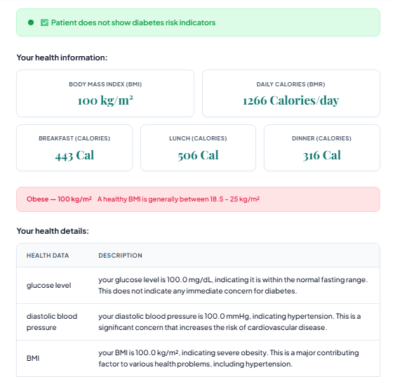
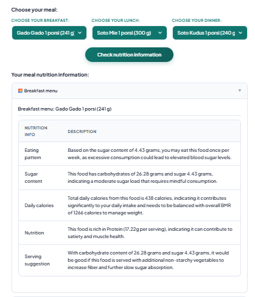
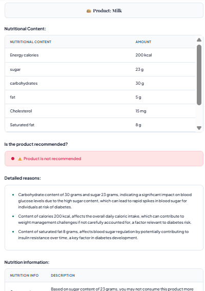
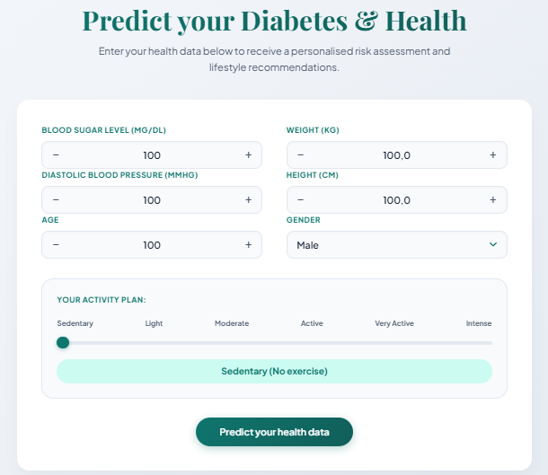
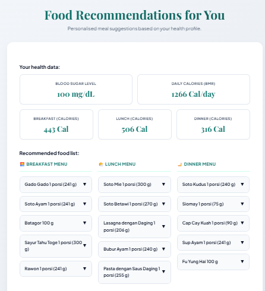
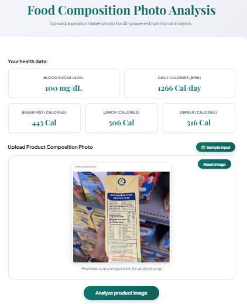

# AI Driven Diabetes Prediction and Personalized Nutritional Recommendation System
This project integrates machine learning and AI to support personalized diabetes management and health improvement through data-driven insights and food recommendations. By predicting diabetes status from patient health data, the system offers tailored health advice. Using these predictions, it suggests traditional Indonesian foods appropriate for various stages of diabetes and provides health insights based on selected foods. Additionally, a computer vision component with OCR detects nutritional information from food labels, allowing AI to offer real-time health guidance based on nutritional content. Together, these components provide a comprehensive, personalized approach to diabetes care and dietary management.


# Table of content

* [For Users](#for-users)
    * [Apps Features](#apps-features)
    * [How to Use the Apps](#how-to-use-the-apps)
* [For Developers](#for-developers)
    * [Project Structure](#project-structure)
    * [Getting Started](#getting-started)
    * [Code Explanation](#code-explanation)
    * [Run the project with Docker (Local)](#run-the-project-with-docker-local)
    * [Deploy to Google Cloud Run](#deploy-to-google-cloud-run)
    * [Contributors](#contributors)
    * [License](#license)


# For Users

## Apps Features

The application consists of 3 main features.

### 1. Diabetes Prediction

Enter your health metrics — glucose level, diastolic blood pressure, weight, height, age, gender, and daily activity level — to receive an ML-powered diabetes status prediction. The system calculates your BMI and daily calorie targets (BMR) and then queries Google Gemini to generate a personalised health data summary, lifestyle guidelines, and a clinical conclusion.

<p align="center"></p>


### 2. Personalised Food Recommendation

Based on your diabetes prediction results and daily calorie needs, the system recommends traditional Indonesian meals for breakfast, lunch, and dinner using a K-Nearest Neighbours (KNN) model. Calorie budgets are split 35 / 40 / 25 % across the three meals so that each suggestion fits your health profile.

<p align="center"></p>

### 3. Food Label Image Analysis (Computer Vision)

Upload a photo of any food product's nutritional label. The system uses Google Gemini's multimodal OCR capability to extract the nutritional composition, then cross-references it against your personal health data to determine whether the product is safe for a person with your diabetes profile.

<p align="center"></p>


## How to use the Apps

### Step 1 — Enter Your Health Data (Diabetes Prediction Page)

On the first page, fill in the form with your current health metrics:

* Glucose level (mg/dL)
* Diastolic blood pressure (mmHg)
* Weight (kg) and Height (cm)
* Age, Gender, and daily Activity level

<p align="center"></p>

Click **Predict your health data**. The system will display your diabetes status, BMI category, daily calorie targets, AI-generated health insights, and personalised lifestyle advice.

### Step 2 — Explore Food Recommendations (Food Recommendation Page)

Navigate to the **Food Recommendations for You** page. Based on your prediction results, the system suggests breakfast, lunch, and dinner options from a traditional Indonesian food dataset. 

<p align="center"></p>

Each suggestion respects your calorie budget for that meal.


### Step 3 — Analyse a Food Label (Image Analysis Page)

Go to the **Food Composition Photo Analysis** page. Upload a photo of a food product's nutritional label (or click **Sample input** to use the provided example). 

<p align="center"></p>

Click **Analyze product image** to receive an AI-generated verdict on whether the product is recommended for your health profile.


# For Developers

## Project Structure

```
final/
├── backend/
│   ├── app.py                              # Flask REST API entry point
│   ├── Dockerfile                          # Backend container build config
│   ├── requirements.txt                    # Python dependencies
│   ├── configuration/
│   │   └── constants.py                    # Gemini client & ML model loader
│   ├── data/
│   │   ├── analysis_input/                 # Sample food label images
│   │   └── dataset/
│   │       ├── diabetes.csv                # Diabetes training dataset
│   │       └── food_calories_dataset.csv   # Indonesian food & nutrition dataset
│   ├── model/                              # Trained ML model file (.pkl)
│   ├── notebooks/
│   │   └── ml_model_diabetes_prediction.ipynb  # Model training notebook
│   ├── pipelines/
│   │   ├── diabetes_prediction.py          # BMI/BMR calculation & AI advice
│   │   ├── food_recommendation.py          # KNN-based food recommendation
│   │   └── image_analysis.py              # OCR + Gemini image analysis
│   └── utils/
│       └── data_cleaning.py               # Food dataset cleaning utilities
├── frontend/
│   ├── Dockerfile                          # Frontend container (nginx)
│   ├── nginx.conf                          # Reverse-proxy & static-file config
│   └── public/
│       ├── index.html                      # Main HTML page
│       └── static/
│           ├── css/styles.css              # Application styles
│           └── js/app.js                   # Client-side logic
├── docker-compose.yml                      # Local multi-container setup
├── cloud-run-deploy.yaml                   # Google Cloud Run deployment spec
├── Makefile                                # Convenience make targets
└── README.md
```

## Getting started

### Dependencies and Prerequisites

| Dependency | Version | Purpose |
|---|---|---|
| Python | 3.11 | Runtime |
| Flask | 3.1.0 | REST API framework |
| Gunicorn | 22.0.0 | WSGI production server |
| scikit-learn | 1.4.2 | Diabetes prediction model & KNN food recommendation |
| pandas | 2.2.3 | Data loading and manipulation |
| numpy | 1.26.4 | Numerical operations |
| Pillow | 10.0.0 | Image processing for food label uploads |
| google-generativeai | 0.8.3 | Google Gemini AI (health advice & OCR analysis) |
| python-dotenv | 1.0.1 | Environment variable management |
| Docker | latest | Container build and orchestration |
| nginx | stable-alpine | Static file serving and API reverse proxy |

### Tech stack

| Layer | Tech Stack |
|---|---|
| Backend API | Python 3.11, Flask 3.1.0, Gunicorn |
| Machine Learning | scikit-learn (pre-trained diabetes classifier + KNN food recommender) |
| AI / LLM | Google Gemini 2.5 Flash Lite (via `google-generativeai`) |
| Computer Vision | Google Gemini multimodal OCR |
| Frontend | HTML5, CSS3, Vanilla JavaScript |
| Web Server | nginx (stable-alpine) |
| Containerisation | Docker, Docker Compose |
| Cloud Deployment | Google Cloud Run (asia-southeast2) |
| Secret Management | Google Cloud Secret Manager |

### Credentials setup

This project requires a Google Gemini API key. Follow these steps:

1. Copy the example environment file:
```bash
cp backend/.env.example backend/.env
```

2. Open `backend/.env` and fill in your actual values:
```bash
nano backend/.env  # or use any text editor
```

3. Below is the full list of required variables:

| Variable | Description | Required |
|---|---|---|
| `GEN_AI_API_KEY` | Google Gemini API key — obtain from [Google AI Studio](https://aistudio.google.com/) | ✅ Yes |

> ⚠️ **Never commit your `.env` file.** Make sure `.env` is listed in your `.gitignore`.

**Example `.env.example` file:**
```env
# .env.example — copy this to .env and fill in your values
GEN_AI_API_KEY=your_gemini_api_key_here
```


## Code explanation

### Key Backend files

| Category | File | Description |
|---|---|---|
| API Entry Point | `app.py` | Flask application with four REST endpoints: `/api/health`, `/api/predict`, `/api/recommend`, and `/api/analyze`. Loads the ML model and food dataset once at startup. |
| Configuration | `configuration/constants.py` | Loads `GEN_AI_API_KEY`, initialises the Gemini client, and loads the pre-trained diabetes ML model from the `model/` directory. Implements a model fallback list for quota resilience. |
| Diabetes Pipeline | `pipelines/diabetes_prediction.py` | Calculates BMI, BMR (Harris-Benedict formula), and daily calorie needs by activity level. Builds a structured health-data string and calls Gemini to generate health summaries, lifestyle guidelines, and a conclusion. |
| Food Recommendation | `pipelines/food_recommendation.py` | Scales the nutritional dataset with `StandardScaler`, fits a cosine-distance `NearestNeighbors` model, and filters Indonesian foods by meal-specific calorie budgets (35 % breakfast, 40 % lunch, 25 % dinner) before returning the top matches. |
| Image Analysis | `pipelines/image_analysis.py` | Accepts an uploaded image, writes it to a temporary file, submits it to Gemini's multimodal endpoint for OCR nutritional extraction, then calls Gemini again to cross-reference the extracted data against the patient's health profile. |
| Data Utilities | `utils/data_cleaning.py` | Reads the food CSV (semicolon-delimited), trims column names, normalises unit formats (mg → g), and returns a cleaned DataFrame ready for the recommendation pipeline. |

### Key Frontend files

| Category | File | Description |
|---|---|---|
| HTML Page | `public/index.html` | Single-page application shell containing all three feature sections (Prediction, Food Recommendation, Image Analysis). |
| Client Logic | `public/static/js/app.js` | Manages application state, form interactions, API calls (`/api/predict`, `/api/recommend`, `/api/analyze`), and dynamic DOM rendering for all three features. |
| Styles | `public/static/css/styles.css` | Application-wide stylesheet. |
| Reverse Proxy | `nginx.conf` | Serves static assets from `/static/`, proxies all `/api/*` requests to the Flask backend, and falls back to `index.html` for client-side routing. |


## Run the project with Docker (Local)

**Prerequisites:** Docker Desktop installed and running.

1. Clone the repository and navigate to the project root:
```bash
git clone <repository-url>
cd final
```

2. Create the backend environment file and add your Gemini API key:
```bash
cp backend/.env.example backend/.env
# Then open backend/.env and set GEN_AI_API_KEY
```

3. Build and start both services:
```bash
docker compose up --build
# OR using make:
make up
```

4. Open your browser and navigate to:
```
http://localhost
```

Additional useful commands:

 Command | Description |
|---|---|
| `make build` | Build (or rebuild) images |
| `make up` | Build and start all containers |
| `make start` | Start already-built containers |
| `make stop` | Stop containers |
| `make down` | Stop and remove containers |
| `make clean` | Full teardown (containers, images, volumes) |
| `make logs` | Tail live logs |


## Deploy to Google Cloud Run

**Prerequisites:** Google Cloud SDK (`gcloud`) installed and running Docker Desktop.

### One-Time Setup

**1. Authenticate Docker with Artifact Registry:**

```bash
gcloud auth configure-docker asia-southeast2-docker.pkg.dev
```

**2. Allow public access (run once after first deploy):**

```powershell
gcloud run services add-iam-policy-binding news-monitoring-prod-v1 `
  --region asia-southeast2 `
  --member="allUsers" `
  --role="roles/run.invoker"
```

### Deploy / Redeploy Steps

1. **Authenticate and set your project:**
```bash
gcloud auth login
gcloud config set project <your-project-id>
```

2. **Enable Artifact Registry:**
```bash
gcloud services enable artifactregistry.googleapis.com
```

3. **Tag both images for Artifact Registry:**
```bash
docker tag ai-diabetes-healtkathon-2024_v1-frontend:latest <region>-docker.pkg.dev/<your-project-id>/<your-repository>/ai-diabetes-healtkathon-2024_v1-frontend:latest
docker tag ai-diabetes-healtkathon-2024_v1-backend:latest <region>-docker.pkg.dev/<your-project-id>/<your-repository>/ai-diabetes-healtkathon-2024_v1-backend:latest
```

4. **Push both images to Artifact Registry:**
```bash
docker push <region>-docker.pkg.dev/<your-project-id>/<your-repository>/ai-diabetes-healtkathon-2024_v1-frontend:latest
docker push <region>-docker.pkg.dev/<your-project-id>/<your-repository>/ai-diabetes-healtkathon-2024_v1-backend:latest
```

5. **Deploy the multi-container service:**
```bash
gcloud run services replace cloud-run-deploy.yaml --region <region>
```

> Replace `<your-project-id>`, `<your-repository>`, `<region>`, and `<your-service-name>` with your actual values. The service URL will be provided by Cloud Run after deployment.


## Contributors
Contributors names and contact info:

* [Zikry Adjie Nugraha](https://github.com/nugrahazikry): Developed the Flask web interface, implemented the Computer Vision AI Food Recommendation feature, and integrated all features with AI to gather health insights.
* [Diki Rustian](https://github.com/dikirust): Built the Diabetes Prediction feature using machine learning.
* [Muhammad Fikri Fadillah](https://github.com/boxside): Created the personalized food with Indonesian local cuisine recommendation feature.

## License

This project is licensed under the **MIT License** — see the [LICENSE](LICENSE) file for details.
